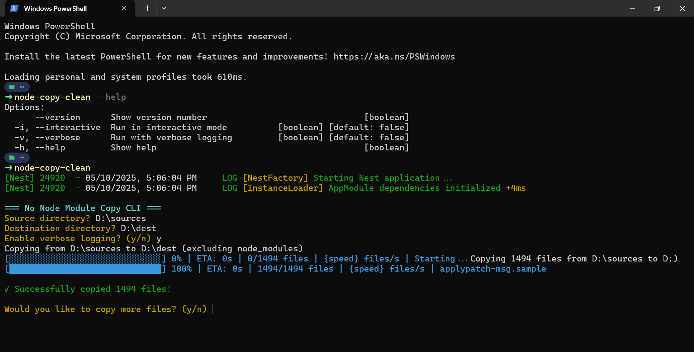

# Node Copy Clean

A command-line utility to copy directories while automatically excluding `node_modules` folders, built with NestJS. This tool provides efficient directory copying with a progress bar and multi-threaded operations for improved performance.



## Features

- Copy directories while skipping all `node_modules` folders
- Progress bar visualization during copying
- Multi-threaded file copying for better performance
- Simple command-line interface

## Installation

You can install this package locally for development:

```bash
# Using npm
npm install -g node-copy-clean

# Using pnpm
pnpm add -g node-copy-clean

# Using yarn
yarn install -g node-copy-clean
```

## Usage

```bash
node-copy-clean [source] [destination]
```

Or run it in interactive mode:

```bash
node-copy-clean -i
```

### Options

- `-i, --interactive`: Run in interactive mode
- `-v, --verbose`: Enable verbose logging
- `-h, --help`: Show help information

### Multiple Copy Operations

After successfully copying files, the CLI will ask if you want to copy more files. This allows you to perform multiple copy operations in a single session without having to restart the tool.

```bash
Copy completed successfully!
Would you like to copy more files? (y/n)
```

- Answer `y` or `yes` to continue with another copy operation
- Answer `n` or any other input to exit the tool

## Development

### Setup

1. Clone the repository:

```bash
git clone https://github.com/kelcho-spense/node-copy-clean.git
cd no-node-module-copy-cli
```

2. Install dependencies:

```bash
npm install
```

3. Build the project:

```bash
npm run build
```

### Running in Development

```bash
npm run start:dev -- "C:\path\to\source" "C:\path\to\destination"
```

Or alternatively:

```bash
npm run cli -- "C:\path\to\source" "C:\path\to\destination"
```

 **with verbose logging** :

```bash
npm run start:dev -- "C:\path\to\source" "C:\path\to\destination" --verbose
```

## Running Tests

To run the unit tests:

**npm** **test**

```bash
npm test
```

To watch tests during development:

```bash
npm run test:watch
```

To run end-to-end tests:

```bash
npm run test:e2e
```

## Quick Test with Sample Directories

Create test directories to verify functionality:

```bash
# Create test directories
mkdir -p test-source/project1/node_modules
mkdir -p test-source/project2/node_modules

# Add some test files
echo "content" > test-source/file1.txt
echo "content" > test-source/project1/file2.txt
echo "content" > test-source/project1/node_modules/should-be-skipped.txt

# Run the tool
npm run start:dev -- "./test-source" "./test-destination" --verbose

# Verify the results
dir test-destination
```

This should copy everything except the [node_modules](vscode-file://vscode-app/c:/Users/KevinComba/AppData/Local/Programs/Microsoft%20VS%20Code/resources/app/out/vs/code/electron-sandbox/workbench/workbench.html) directories.

### Adding Features

Consider implementing these additional features:

1. **File filtering**: Allow users to specify file patterns to include/exclude
2. **Dry-run mode**: Preview operations without actually copying files
3. **Verbose logging**: More detailed output for debugging
4. **Custom exclusions**: Allow users to specify additional directories to exclude
5. **Parallel processing controls**: Allow users to set the level of parallelism

## Contributing

Contributions are welcome! Please follow these steps:

1. Fork the repository
2. Create a feature branch (`git checkout -b feature/amazing-feature`)
3. Commit your changes (`git commit -m 'Add some amazing feature'`)
4. Push to the branch (`git push origin feature/amazing-feature`)
5. Open a Pull Request

## License

This project is licensed under the MIT License - see the [LICENSE](LICENSE) file for details.
